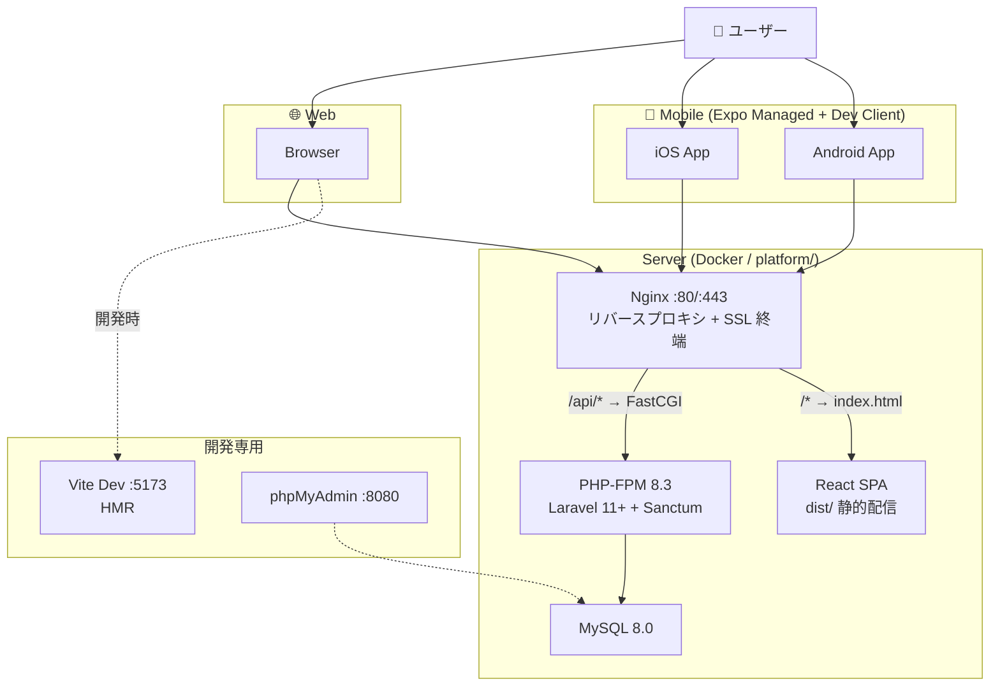
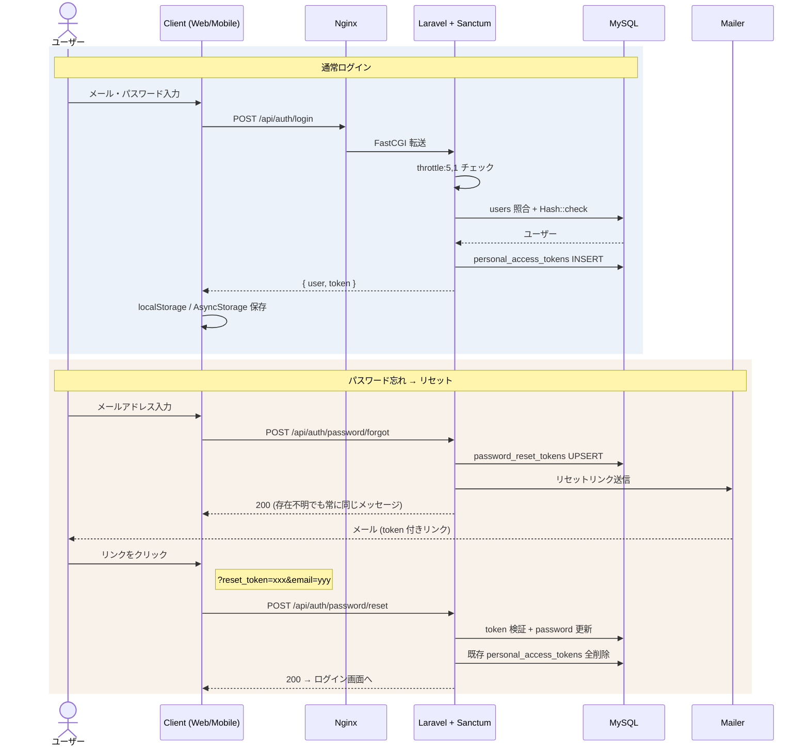
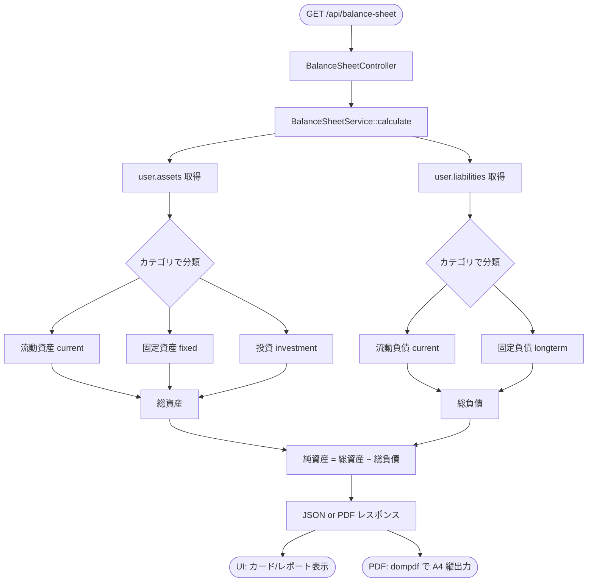
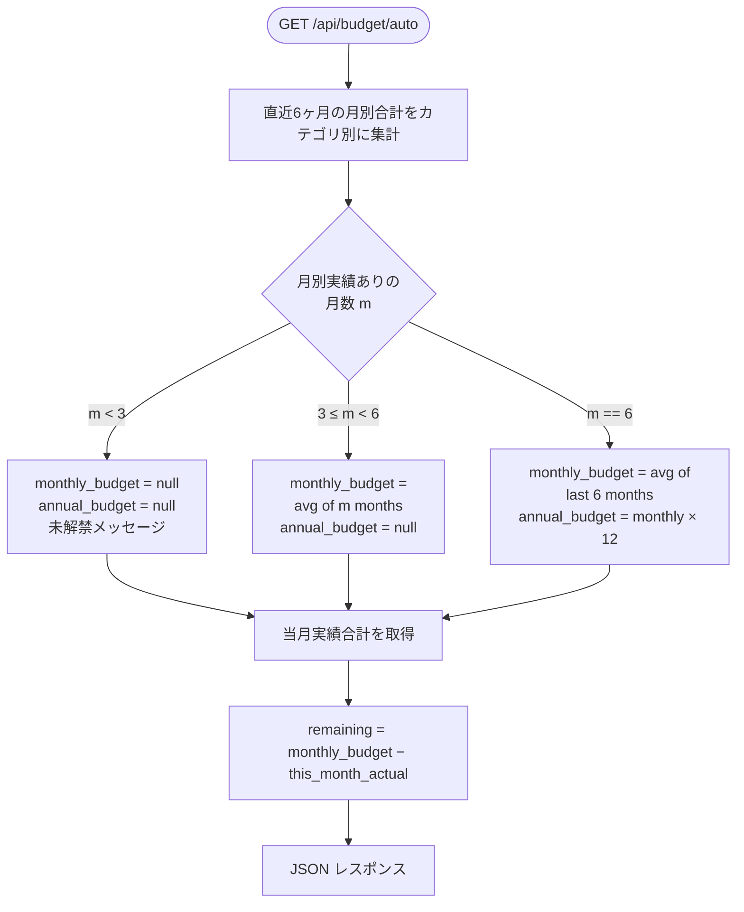
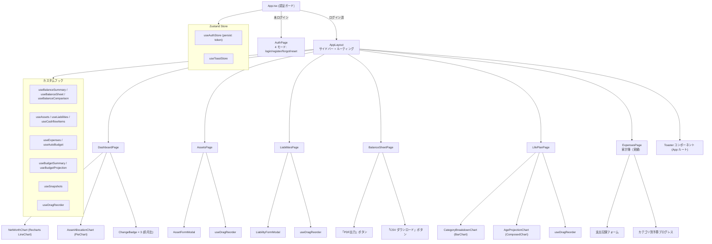
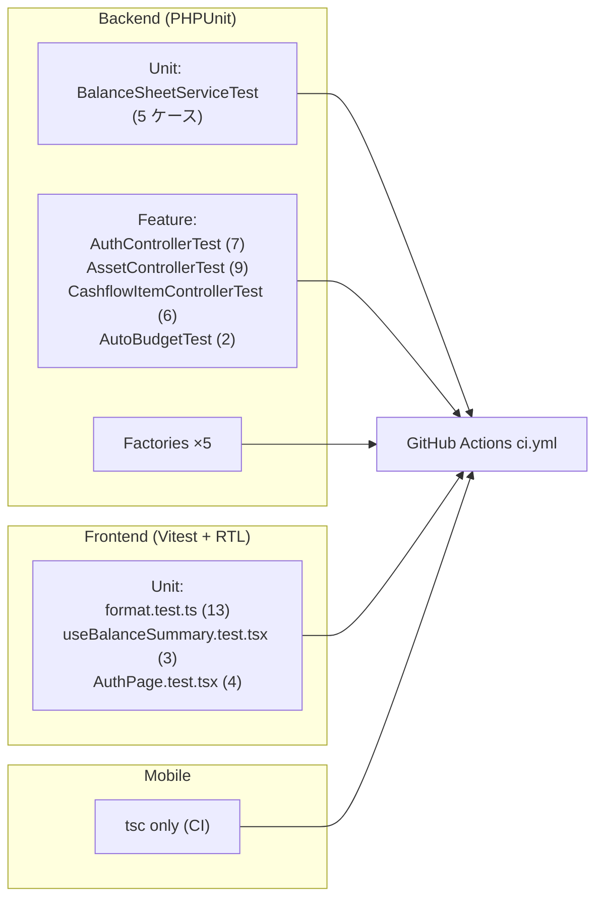
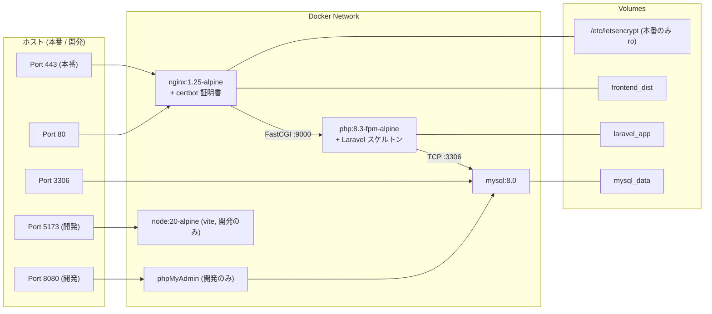
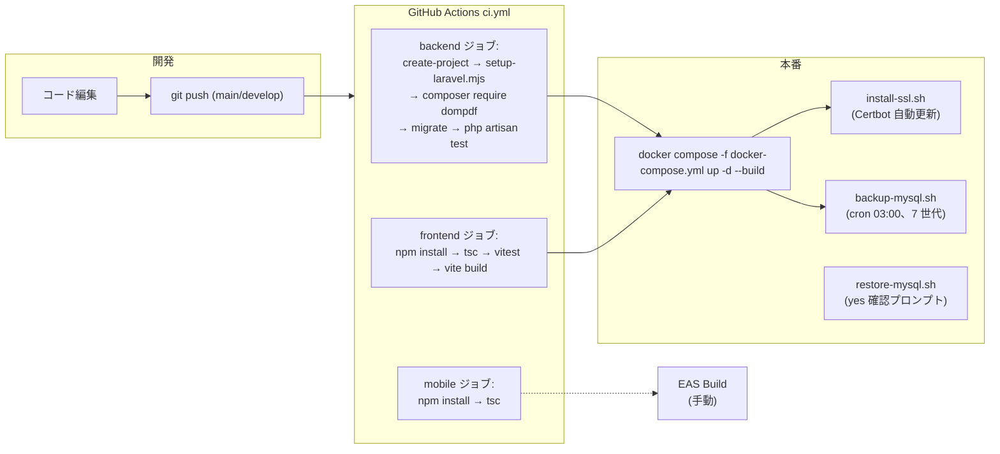

# 家計バランスシートアプリ — 設計資料

> 個人・家計管理向け B/S + ライフプラン + 実績家計簿 + モバイル対応システム
> Stack: React 18 + TypeScript / Laravel 11+ / MySQL 8 / Docker / Expo Managed (RN 0.74)

最終更新: 2026-05-10

---

## 1. システムアーキテクチャ全体図



**通信プロトコル**:
- Web: Cookie + Bearer Token (Sanctum SPA)
- Mobile: Bearer Token のみ（`AsyncStorage` 永続化）
- 全クライアント共通の `/api/*` を利用

---

## 2. ER図（データベース設計）

```mermaid
erDiagram
    users ||--o{ assets : "保有"
    users ||--o{ liabilities : "負担"
    users ||--o{ balance_snapshots : "記録"
    users ||--o{ cashflow_items : "計画"
    users ||--o{ expenses : "実績"
    users ||--o{ personal_access_tokens : "発行"

    users {
        bigint id PK
        string name
        string email UK
        string password
        timestamp email_verified_at
        timestamps
    }

    assets {
        bigint id PK
        bigint user_id FK
        string name
        enum category "current|fixed|investment"
        decimal amount "13,2"
        string note
        unsignedInt sort_order "default 0"
        timestamps
    }

    liabilities {
        bigint id PK
        bigint user_id FK
        string name
        enum category "current|longterm"
        decimal amount "13,2"
        string note
        unsignedInt sort_order "default 0"
        timestamps
    }

    cashflow_items {
        bigint id PK
        bigint user_id FK
        string name
        enum direction "income|expense"
        enum frequency "fixed|variable"
        string category "60 chars"
        string vendor "120 chars"
        decimal monthly_amount "12,2"
        decimal annual_amount "12,2"
        unsignedTinyInt start_age
        unsignedTinyInt end_age
        string note
        string url "500 chars"
        unsignedInt sort_order
        timestamps
    }

    expenses {
        bigint id PK
        bigint user_id FK
        string category "60 chars"
        decimal amount "12,2"
        date occurred_at
        string note
        timestamps
    }

    balance_snapshots {
        bigint id PK
        bigint user_id FK
        string year_month UK "YYYY-MM"
        decimal total_assets
        decimal total_liabilities
        decimal net_worth
        timestamp recorded_at
        timestamps
    }

    password_reset_tokens {
        string email PK
        string token
        timestamp created_at
    }
```

**インデックス**:
- `assets`/`liabilities`/`cashflow_items`: `(user_id, sort_order)` で並び順表示
- `expenses`: `(user_id, occurred_at)` + `(user_id, category, occurred_at)`（自動予算の月次集計）
- `balance_snapshots`: `(user_id, year_month) UNIQUE`（前月比 / 推移グラフ）

**制約 (アプリケーションレベル)**:
- 同ユーザー × 同カテゴリ内で `name` の重複禁止 (`Concerns\EnforcesUserScope`)
- 1 ユーザーあたり assets / liabilities / cashflow_items それぞれ 200 件まで

---

## 3. API エンドポイント一覧

```mermaid
mindmap
  root((Laravel API<br/>/api))
    認証 (5 req/min/IP)
      POST /auth/register
      POST /auth/login
      POST /auth/logout (要auth)
      GET  /auth/me (要auth)
      POST /auth/password/forgot
      POST /auth/password/reset
    資産 / 負債 (60 req/min/user)
      GET    /assets (一覧)
      POST   /assets
      PUT    /assets/{id}
      DELETE /assets/{id}
      POST   /assets/reorder
      GET    /assets/export (CSV)
      ...同型 /liabilities
    ライフプラン
      GET    /cashflow-items
      POST   /cashflow-items
      PUT    /cashflow-items/{id}
      DELETE /cashflow-items/{id}
      POST   /cashflow-items/reorder
      GET    /cashflow-items/export (CSV)
    バランスシート
      GET /balance-sheet (現在のB/S)
      GET /balance-sheet/summary (Dashboard 用)
      GET /balance-sheet/comparison (前月比)
      GET /balance-sheet/export (PDF)
    スナップショット
      GET    /snapshots
      POST   /snapshots
      DELETE /snapshots/{id}
    予算
      GET /budget/summary (計画値ベース)
      GET /budget/projection (年齢別推移)
      GET /budget/auto (実績ベース自動予算)
    実績家計簿 (§O)
      GET    /expenses
      POST   /expenses
      PUT    /expenses/{id}
      DELETE /expenses/{id}
```

**認証**: Laravel Sanctum (`HasApiTokens`)、`Authorization: Bearer {token}` ヘッダ。
**Rate Limit**: `auth/*` は IP ベース 5 req/min、認証付ルートは Sanctum トークンの user 単位で 60 req/min。

---

## 4. 認証フロー



---

## 5. バランスシート計算フロー



**派生 API**:
- `summary` — Dashboard 用に `asset_ratio` を追加
- `comparison` — 最新 2 スナップショットの差分 (`{ amount, percent }`、件数別 graceful fallback)
- `export` — `Pdf::loadView('pdf.balance-sheet')->setPaper('a4', 'portrait')->download()`

---

## 6. 実績ベース自動予算 (§O)

> `cashflow_items`（計画値）と独立した実績テーブル `expenses` から、過去実績で月次・年次予算を自動算出。



**ゲート条件**:
| 月数 m | 月予算 | 年予算 |
|---|---|---|
| m < 3 | `null`（未解禁） | `null` |
| 3 ≤ m < 6 | `avg(過去 m ヶ月)` | `null` |
| m == 6 | `avg(過去 6 ヶ月)` | `monthly × 12` |

**入力後のリアルタイム更新**: `POST /expenses` 完了後にクライアント側で `useAutoBudget.refetch()` を呼び、当該カテゴリの `remaining` を即時反映 + トースト表示。

---

## 7. Reactコンポーネントツリー



---

## 8. モバイルアーキテクチャ (§L / §N)

> Expo Managed + Dev Client (`expo-dev-client`) 構成。Web 版と同じ Laravel API を Bearer Token のみで利用。

```mermaid
graph TD
    M["App.tsx<br/>useAuthStore.hydrate() で AsyncStorage から復元"]
    M --> RN["RootNavigator (NavigationContainer)"]

    RN -->|token == null| Auth["AuthScreen"]
    RN -->|token あり| Tabs["BottomTabs ×6"]

    Tabs --> T1["DashboardScreen"]
    Tabs --> T2["AssetsScreen"]
    Tabs --> T3["LiabilitiesScreen"]
    Tabs --> T4["BalanceSheetScreen"]
    Tabs --> T5["LifePlanScreen"]
    Tabs --> T6["ExpensesScreen"]

    T6 --> EF["ExpenseFormScreen<br/>(Stack Modal)"]
    T6 --> RS["ReceiptScannerScreen<br/>(Stack)"]

    RS -->|expo-camera| Cam["撮影 (back facing)"]
    Cam -->|expo-image-manipulator| Img["1500px / JPEG 80%"]
    Img -->|@react-native-ml-kit/text-recognition| OCR["端末内 OCR"]
    OCR -->|parseReceipt| EF
    EF -->|POST /api/expenses + useAutoBudget.refetch| Live["残予算リアルタイム更新"]
```

**共有戦略**: `app/mobile/src/types/` `utils/format.ts` `utils/receipt.ts` `api/index.ts` `stores/*` `hooks/index.ts` は Web 版と同型をコピー運用（将来 npm workspaces 化検討）。

**主な差分**:
- `localStorage.getItem` → `AsyncStorage.getItem` で全体 async 化
- `BASE_URL`: `process.env.EXPO_PUBLIC_API_URL ?? Constants.expoConfig.extra.apiUrl ?? 'http://localhost/api'` の三段フォールバック
- CSV エクスポート: `<a download>` → `expo-file-system + expo-sharing` で iOS Files / Android ダウンロード
- Recharts → victory-native（Skia ベース、現状はプレースホルダのみ）

---

## 9. セキュリティ設計 (§I)

| 観点 | 対策 |
|---|---|
| 認証 | Sanctum Bearer Token、`HasApiTokens` |
| パスワード保管 | `Hash::make()` (bcrypt) |
| パスワードリセット | `Password::broker()->sendResetLink()` + 列挙攻撃対策（forgot は常に同じレスポンス）+ リセット成功時に `tokens()->delete()` で全セッション失効 |
| Rate Limit | `auth/*`: 5 req/min/IP / 認証付き: 60 req/min/user |
| 認可 | 各 Controller で `$resource->user_id !== auth()->id()` チェック (`abort_if(..., 403)`) |
| 入力検証 | FormRequest で `EnforcesUserScope` Trait による重複・上限チェック |
| CORS | `config/cors.php` で `allowed_origins` を指定（モバイル含む） |
| HTTPS | 本番は `platform/scripts/install-ssl.sh` で Let's Encrypt 自動取得 |
| トークン保管 (Mobile) | `AsyncStorage` (将来 `expo-secure-store` に移行可能) |

---

## 10. テスト戦略 (§E)



**実行**:
- Backend: `php artisan test` (CI で `composer create-project laravel/laravel skeleton` → `setup-laravel.mjs` で上書き → migrate → test)
- Frontend: `npm test` (Vitest + jsdom)
- Mobile: `npm run tsc` のみ（実機ビルドは EAS で別途）

---

## 11. Dockerコンテナ構成



---

## 12. CI/CD + 運用 (§J)



---

## 13. ディレクトリ構成

```
docker-balance-sheet/
├── app/
│   ├── backend/                  Laravel ソース (user 作成ファイルのみ)
│   │   ├── app/
│   │   │   ├── Http/Controllers/{Api,Concerns}/
│   │   │   ├── Http/Requests/{Asset,Auth,Cashflow,Concerns,Expense,Liability}/
│   │   │   ├── Http/Resources/
│   │   │   ├── Models/
│   │   │   └── Services/
│   │   ├── database/{migrations,seeders,factories}/
│   │   ├── resources/views/pdf/
│   │   ├── tests/{Feature,Unit}/
│   │   └── routes/api.php
│   ├── frontend/                 React Web (Vite)
│   │   ├── api/ components/ hooks/ pages/ stores/ tests/ types/ utils/
│   │   ├── App.tsx main.tsx index.html
│   │   ├── styles.css
│   │   ├── package.json tsconfig.json vite.config.ts vite-env.d.ts
│   └── mobile/                   Expo Managed + Dev Client
│       ├── App.tsx
│       ├── app.json eas.json package.json tsconfig.json babel.config.js
│       └── src/
│           ├── api/ stores/ types/ utils/ hooks/
│           ├── screens/ (Auth/Dashboard/Assets/Liabilities/BalanceSheet/LifePlan/Expenses + ExpenseForm/ReceiptScanner)
│           ├── components/ (theme, Card, ChangeBadge)
│           └── navigation/RootNavigator.tsx
├── platform/                    Docker + 運用スクリプト
│   ├── docker-compose.yml docker-compose.override.yml
│   ├── Dockerfile Dockerfile.frontend Dockerfile.frontend.dev
│   ├── default.conf my.cnf opcache.ini php.ini
│   ├── Makefile
│   ├── setup-laravel.mjs setup-laravel.sh
│   ├── setup-react.mjs setup-react.sh
│   ├── setup.mjs
│   └── scripts/
│       ├── install-ssl.sh
│       ├── backup-mysql.sh
│       └── restore-mysql.sh
├── doc/
│   ├── design.md      (この文書)
│   ├── operations.md  (運用手順)
│   ├── task.md        (タスクリスト)
│   ├── history.md     (実装履歴)
│   └── work.md        (モバイル詳細手順)
└── .github/workflows/ci.yml
```

> **Laravel スケルトン位置**: `app/backend/` には user 作成ファイルしか入っていない。`composer.json` / `vendor/` / `bootstrap/` 等は別途 `composer create-project laravel/laravel` で生成し、`platform/setup-laravel.mjs` でソースを上書きする運用。
