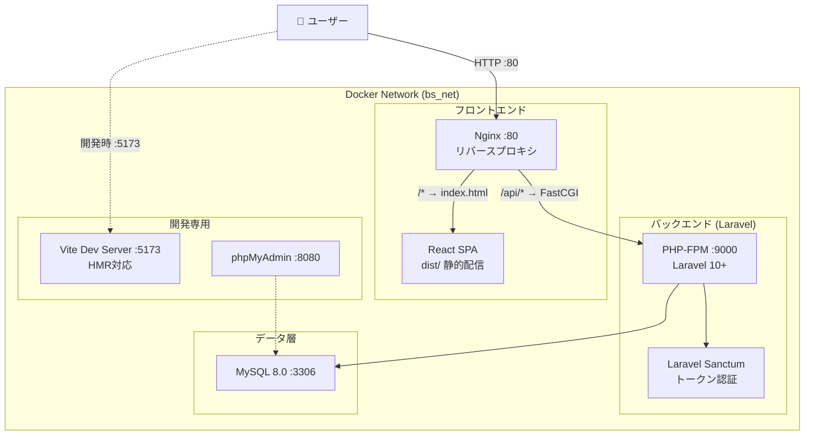
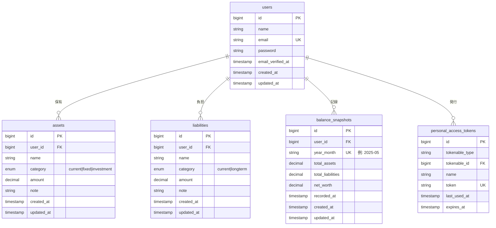
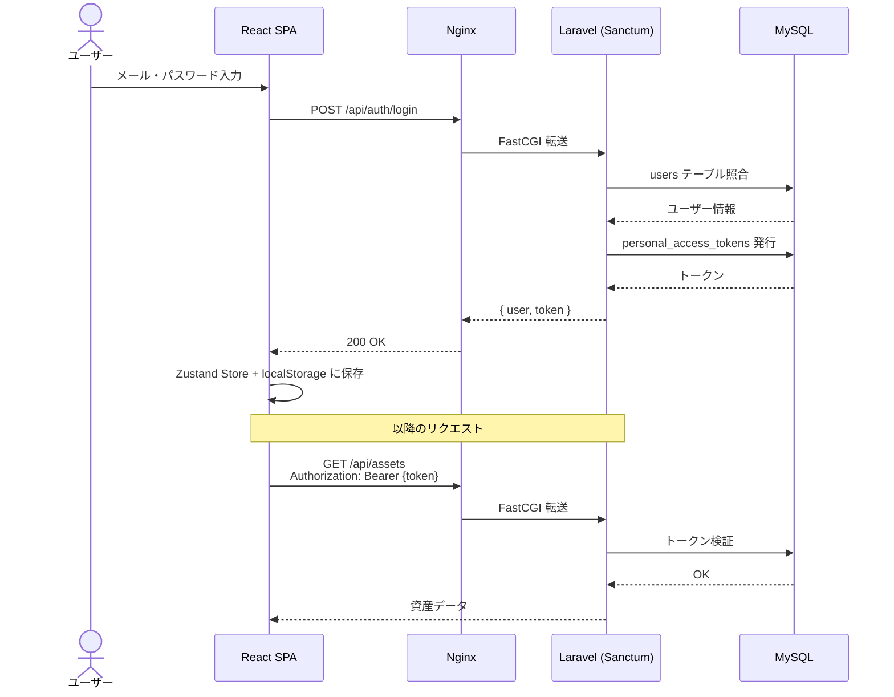
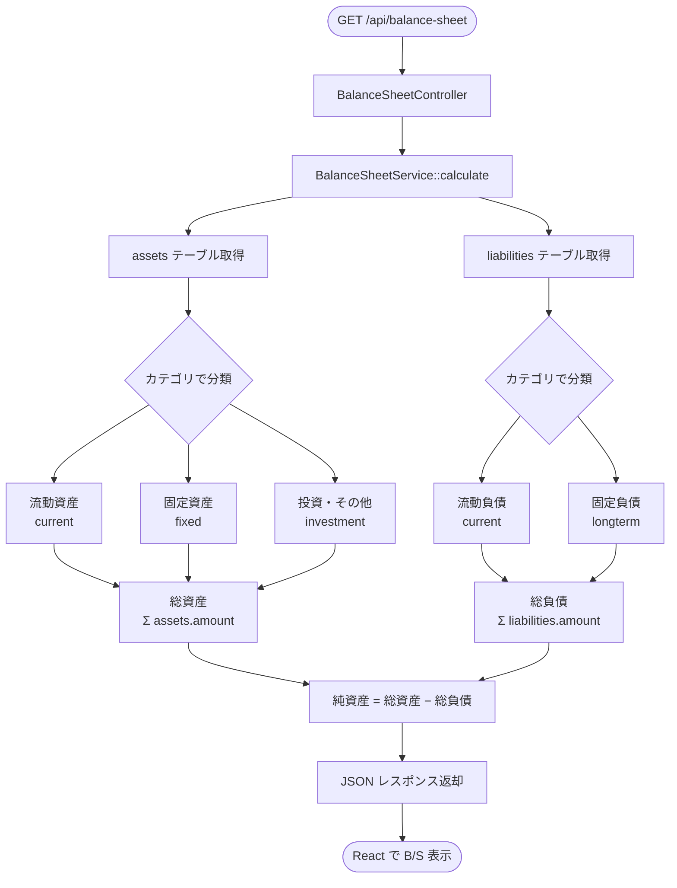
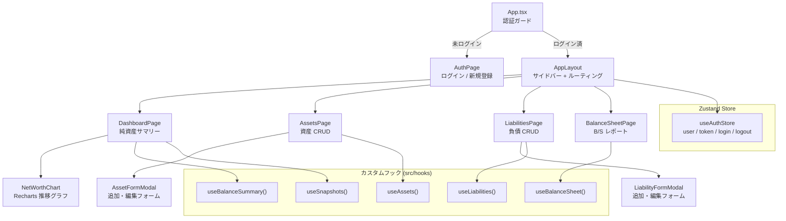
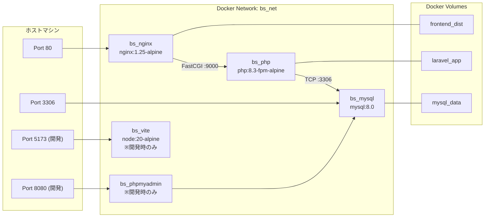
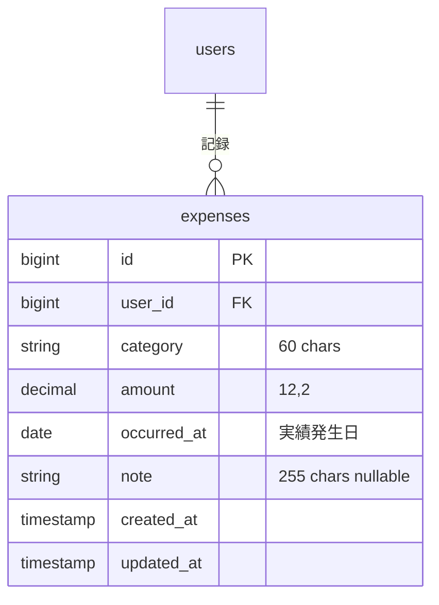
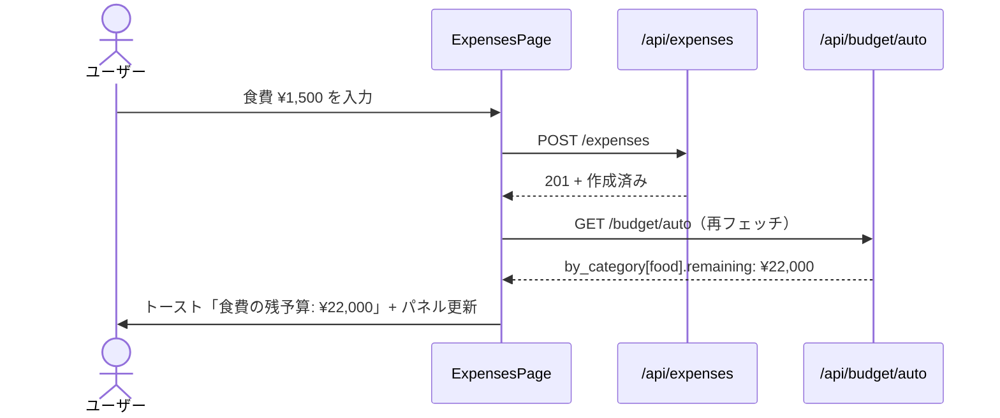
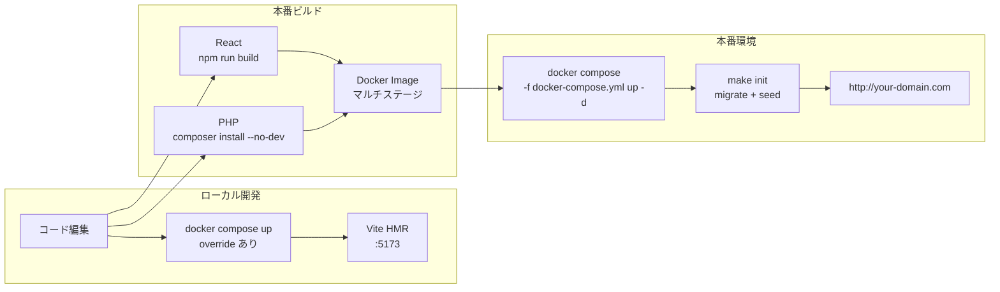

# 家計バランスシートアプリ — 設計資料

> 個人・家計管理向け バランスシート算出システム
> Stack: React + TypeScript / Laravel 10+ / MySQL 8 / Docker

---

## 1. システムアーキテクチャ全体図



---

## 2. ER図（データベース設計）



---

## 3. API エンドポイント一覧

```mermaid
mindmap
  root((Laravel API<br/>/api))
    認証
      POST /auth/register
      POST /auth/login
      POST /auth/logout
      GET /auth/me
    資産
      GET /assets
      POST /assets
      GET /assets/{id}
      PUT /assets/{id}
      DELETE /assets/{id}
    負債
      GET /liabilities
      POST /liabilities
      GET /liabilities/{id}
      PUT /liabilities/{id}
      DELETE /liabilities/{id}
    バランスシート
      GET /balance-sheet
      GET /balance-sheet/summary
    スナップショット
      GET /snapshots
      POST /snapshots
      DELETE /snapshots/{id}
    実績（§O）
      GET /expenses
      POST /expenses
      PUT /expenses/{id}
      DELETE /expenses/{id}
      GET /budget/auto
```

---

## 4. 認証フロー



---

## 5. バランスシート計算フロー



---

## 6. Reactコンポーネントツリー



---

## 7. Dockerコンテナ構成



---

## 7.5 実績ベース自動予算（§O）

> `cashflow_items`（計画値）と独立した **実績** テーブル `expenses` を追加。過去実績から月次・年次予算を自動算出し、当月の残予算をリアルタイムに表示する。

### 7.5.1 ER 拡張



インデックス:
- `(user_id, occurred_at)` — 月次集計
- `(user_id, category, occurred_at)` — カテゴリ別月次集計

### 7.5.2 自動予算アルゴリズム


- **月の判定**: `occurred_at` の YYYY-MM 単位でグループ化、当月を除く直近 6 ヶ月。
- **平均**: 単純平均。当月以前で 1 円以上の実績がある月のみカウント。
- **3 ヶ月**: 当月以外の直近 6 ヶ月のうち実績があった月が 3 ヶ月以上 → 月予算解禁。
- **6 ヶ月**: 直近 6 ヶ月**すべて**で実績があれば年予算解禁。
- **後でユーザが上書き可能**（将来拡張: `budget_overrides` テーブル）。

### 7.5.3 レスポンス例

```json
{
  "as_of": "2026-05-07",
  "by_category": [
    {
      "category": "food",
      "months_with_data": 6,
      "monthly_budget": 42000,
      "annual_budget": 504000,
      "this_month_actual": 18500,
      "remaining": 23500
    },
    {
      "category": "entertainment",
      "months_with_data": 2,
      "monthly_budget": null,
      "annual_budget": null,
      "this_month_actual": 8200,
      "remaining": null
    }
  ],
  "totals": {
    "monthly_budget": 152000,
    "annual_budget": 1224000,
    "this_month_actual": 35200,
    "remaining": 116800
  }
}
```

### 7.5.4 UI フロー



- **入力後 700ms 以内に残予算を更新**（POST 完了 → fetch /budget/auto → setState）
- **未解禁カテゴリ**には「あと N ヶ月分のデータで月予算が解禁されます」を表示
- **超過時**: `remaining < 0` で赤バッジ + トーストで警告

---

## 8. デプロイフロー


