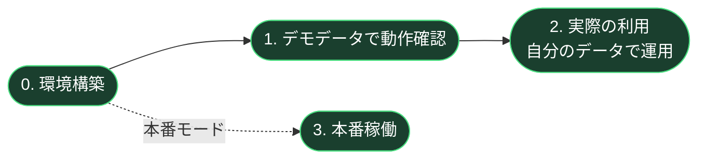
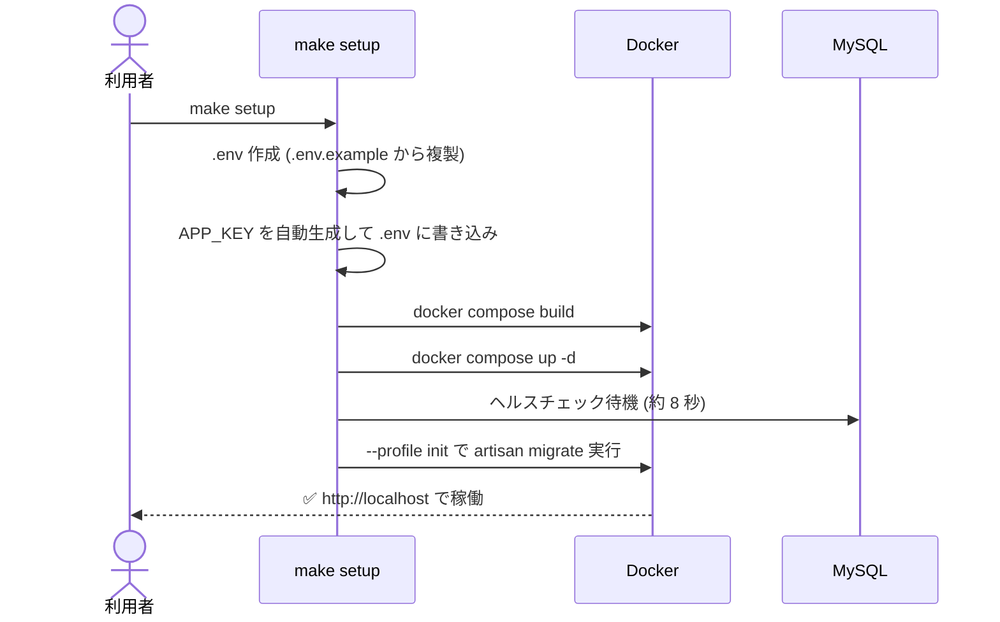
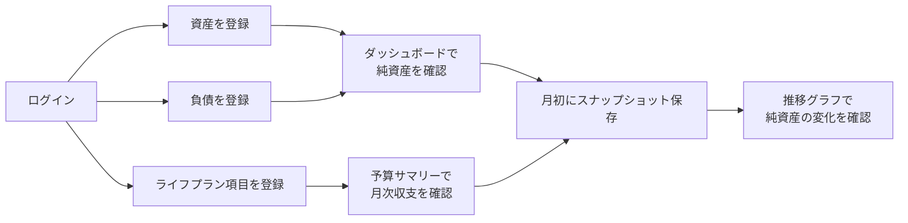
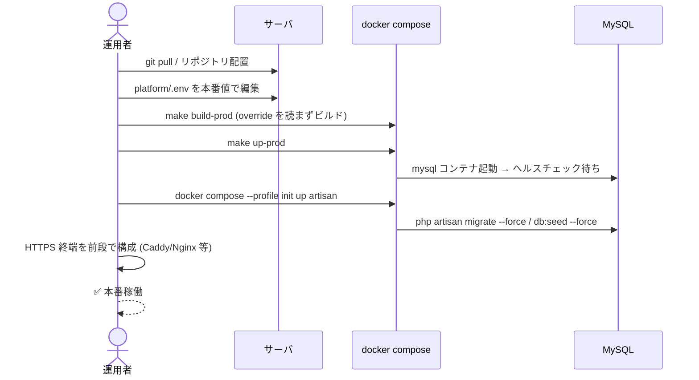
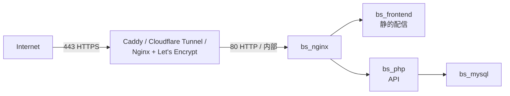

# 運用手順書 — 家計バランスシート

> 対象読者: 本アプリを「自分用に立ち上げて使いたい」「デモを試したい」「本番として常用したい」利用者・運用者。
> 本書はリポジトリ（`app/backend`, `app/frontend`, `platform/`）の構成を前提に、3つの利用シナリオを順に説明する。



---

## 0. 環境構築（共通の初回セットアップ）

デモ・本利用・本番のいずれでも最初に必要となる手順。

### 0.1 前提条件

| 項目 | 要件 |
|---|---|
| OS | macOS / Linux / Windows 10+（WSL2 推奨、ネイティブも対応） |
| Docker Desktop | 4.x 以降 (Docker Compose v2 対応) |
| Node.js | 18+（`setup.mjs` を使う場合のみ必須） |
| 必要ポート | `80` / `3306` / `5173` / `8080` が空いていること |
| ディスク空き | 概ね 2GB 以上 |

> Docker Desktop が起動していない場合は先に起動する。

### 0.1.1 クロスプラットフォーム注意事項

| OS | 推奨セットアップ方法 | 備考 |
|---|---|---|
| macOS | `make setup` または `node platform/setup.mjs` | どちらでも可 |
| Linux | `make setup` または `node platform/setup.mjs` | どちらでも可 |
| Windows (WSL2) | `make setup`（WSL2 上の Ubuntu 等で実行） | Docker Desktop は WSL2 統合を有効化 |
| Windows (ネイティブ / PowerShell) | `node platform\setup.mjs` | `make` 不要。Node.js 18+ が必要 |

**改行コード:** リポジトリ直下の `.gitattributes` で `.sh` / `Dockerfile` / `.env` 等を **強制 LF** にしているため、Windows の `core.autocrlf=true` 環境で clone しても Docker ビルドは壊れない。既に CRLF で取得してしまった場合は次で修復:

```bash
git rm --cached -r .
git reset --hard HEAD
```

### 0.2 リポジトリ構成

```
docker-balance-sheet/
├── app/
│   ├── backend/    Laravel ソース（PSR-4 構成のまま Docker で配置）
│   └── frontend/   React + Vite ソース
└── platform/       Docker / Nginx / DB 設定の集約先
```

`platform/` 配下からすべての操作を行う。

### 0.3 環境変数の作成（`platform/.env`）

```bash
cd platform
cp .env.example .env
```

`APP_KEY` の生成（`make setup` / `node setup.mjs` を使う場合は自動生成されるためスキップ可）:

**macOS（BSD sed）**:
```bash
KEY=$(docker run --rm php:8.3-cli php -r "echo 'base64:'.base64_encode(random_bytes(32));")
sed -i '' "s|^APP_KEY=.*|APP_KEY=$KEY|" .env
```

**Linux / WSL2（GNU sed）**:
```bash
KEY=$(docker run --rm php:8.3-cli php -r "echo 'base64:'.base64_encode(random_bytes(32));")
sed -i "s|^APP_KEY=.*|APP_KEY=$KEY|" .env
```

**Windows PowerShell**:
```powershell
$KEY = "base64:" + [Convert]::ToBase64String((1..32 | ForEach-Object { Get-Random -Max 256 } | ForEach-Object { [byte]$_ }))
(Get-Content .env) -replace '^APP_KEY=.*', "APP_KEY=$KEY" | Set-Content .env
```

**OS非依存（Node.js）**:
```bash
node -e "const c=require('crypto');console.log('base64:'+c.randomBytes(32).toString('base64'))"
# 出力を .env の APP_KEY= に貼り付け
```

`.env` で必ず確認するキー:

| キー | 用途 | 既定値 |
|---|---|---|
| `APP_ENV` | `local` / `production` | `local` |
| `APP_KEY` | Laravel 暗号化鍵（**必須**） | 空欄 |
| `APP_URL` | 公開 URL | `http://localhost` |
| `APP_DEBUG` | デバッグ表示 | `true`（本番では `false`） |
| `DB_DATABASE` / `DB_USERNAME` / `DB_PASSWORD` | DB 接続情報 | `balance_sheet` / `bs_user` / `secret` |

### 0.4 ワンコマンドでの初回セットアップ

#### macOS / Linux / WSL2

```bash
cd platform
make setup
```

#### Windows ネイティブ（make 不要）

```powershell
cd platform
node setup.mjs
```

`make setup` および `node setup.mjs` で実行される内容（同等）:



完了後、コンテナの状態確認:

```bash
docker compose ps
```

期待値:

| NAME | 役割 | STATUS |
|---|---|---|
| `bs_nginx` | リバースプロキシ + 静的配信 | Up |
| `bs_php` | Laravel (PHP-FPM) | Up |
| `bs_frontend` | React 本番ビルド成果物 | Up |
| `bs_mysql` | MySQL 8 | Up (healthy) |
| `bs_vite` | Vite 開発サーバ（override 適用時のみ） | Up |
| `bs_phpmyadmin` | phpMyAdmin（override 適用時のみ） | Up |

---

## 1. デモデータでの動作確認手順

> 目的: アプリの全機能を一通り触って動作確認する。実データを入れる前のリハーサルにも使える。

### 1.1 デモ用シードユーザー

| 項目 | 値 |
|---|---|
| Email | `test@example.com` |
| Password | `password` |
| 名前 | テストユーザー |

`CashflowItemSeeder` 実行時に `firstOrCreate` で自動作成される（存在しなければ作成）。

### 1.2 デモデータ投入

ライフプラン項目（収入・住居費・光熱通信・サブスク等の約 60 項目テンプレート）を投入する。

```bash
cd platform
docker compose exec -T php php artisan db:seed --class=Database\\Seeders\\CashflowItemSeeder
```

特徴:

- 主要サブスク（Netflix / Amazon Prime / YouTube / Oura など）には**購入先**と**解約 URL** を自動付与。
- `name` で `firstOrCreate` するため**再実行しても重複しない**。
- 金額は円単位、年齢区間（`start_age` / `end_age`）入りで挿入される。

### 1.3 デモ確認フロー

```mermaid
flowchart TD
    Start([http://localhost を開く]) --> Login[test@example.com / password でログイン]
    Login --> Dash[ダッシュボード:<br/>純資産 / 月次収支カード / 円グラフ]
    Dash --> Asset[資産ページ:<br/>サンプル資産を1件追加]
    Asset --> Liab[負債ページ:<br/>サンプル負債を1件追加]
    Liab --> BS[バランスシートページ:<br/>計算結果を確認]
    BS --> Life[ライフプラン:<br/>シード済み60項目を確認]
    Life --> CSV[CSVダウンロードを各ページで試行]
    CSV --> Snap[スナップショット保存]
    Snap --> Done([デモ完了])
```

### 1.4 API レベルでの疎通確認

```bash
curl -s -X POST http://localhost/api/auth/login \
  -H "Content-Type: application/json" \
  -H "Accept: application/json" \
  -d '{"email":"test@example.com","password":"password"}'
```

レスポンスに `user` と `token` が返れば正常。

### 1.5 デモデータの初期化（やり直したいとき）

```bash
make migrate-fresh    # ⚠️ 全テーブル DROP → 再作成 + 全シーダー再実行
```

---

## 2. 実際の利用手順（自分のデータで運用）

> 目的: 自分用の家計簿として日常運用する。デモユーザーとは別アカウントを作成して使う。

### 2.1 自分用アカウントの作成

#### 方法 A: ブラウザから新規登録（推奨）

1. `http://localhost` にアクセス
2. 「新規登録」から自分の Email / パスワードを入力
3. ログイン後、ダッシュボードが空の状態で表示される

#### 方法 B: artisan tinker で作成

```bash
docker compose exec -T php php artisan tinker --execute='
\App\Models\User::firstOrCreate(
    ["email" => "you@example.com"],
    ["name" => "Your Name", "password" => bcrypt("your-password")]
);'
```

### 2.2 実データ入力の流れ



### 2.3 主な操作

| やりたいこと | 操作 |
|---|---|
| 資産を増やす（預金・株・不動産など） | 「資産」ページ → 「追加」モーダル |
| 負債を増やす（住宅ローン・カード等） | 「負債」ページ → 「追加」モーダル |
| 月次の固定費を登録 | 「ライフプラン」ページで `direction=expense / frequency=fixed` を追加 |
| 副業・賞与など変動収入 | `direction=income / frequency=variable` で追加 |
| 解約候補のサブスクを管理 | `vendor` と `url`（解約ページ）を入れておくと項目名がリンクになる |
| 月次集計を見る | ダッシュボードの「月間収入 / 月間支出 / 月間収支」3カード |
| 資産配分を見る | ダッシュボードの円グラフ（流動・固定・投資の構成比） |
| Excel で集計 | 各ページ右上の「CSV ダウンロード」（BOM 付き UTF-8） |

### 2.4 推奨される定例運用

| 頻度 | 操作 | 目的 |
|---|---|---|
| 都度 | 資産・負債の金額更新 | 残高反映 |
| 月初 | バランスシートページ → 「スナップショット保存」 | 純資産の履歴を残す |
| 月次 | 予算サマリーで赤字チェック | マイナス時は警告色で表示される |
| 四半期 | CSV ダウンロードしてバックアップ | DB 障害時の保険 |

### 2.5 主要 API（外部連携・自動化向け）

| Method | Path | 用途 |
|---|---|---|
| POST | `/api/auth/login` | ログイン（token 発行） |
| GET / POST / PUT / DELETE | `/api/assets` | 資産 CRUD |
| GET / POST / PUT / DELETE | `/api/liabilities` | 負債 CRUD |
| GET / POST / PUT / DELETE | `/api/cashflow-items` | ライフプラン CRUD |
| GET | `/api/budget/summary` | 月次・年次の収支集計 |
| GET | `/api/assets/export` | 資産 CSV |
| GET | `/api/liabilities/export` | 負債 CSV |
| GET | `/api/cashflow-items/export` | ライフプラン CSV |
| POST | `/api/snapshots` | スナップショット保存 |

`monthly_amount` または `annual_amount` のいずれか片方のみ送信した場合、サーバ側で `× 12` または `÷ 12` により自動補完される。

### 2.6 日常コマンド早見表

```bash
make up              # 朝・PC再起動後の起動
make down            # 終了
make logs            # 全ログ追跡
make logs-php        # PHP のみ
make logs-nginx      # Nginx のみ
make shell           # PHP コンテナに入る
make artisan CMD="migrate:status"   # 任意 artisan コマンド
make seed            # シーダー再実行
```

---

## 3. 本番稼働手順

> 目的: 自宅サーバ・VPS・クラウド VM 等で常用稼働させる。`docker-compose.override.yml`（HMR・phpMyAdmin）は使わず、本番用の compose ファイルのみを使う。

### 3.1 本番モードの定義

| 観点 | 開発モード | **本番モード** |
|---|---|---|
| compose ファイル | `docker-compose.yml` + `override.yml` | `docker-compose.yml` のみ |
| Vite | `bs_vite` HMR サーバ稼働 | フロントは静的ビルドのみ（`bs_frontend`） |
| phpMyAdmin | `bs_phpmyadmin` 公開 | 起動しない |
| `APP_ENV` | `local` | `production` |
| `APP_DEBUG` | `true` | `false` |

### 3.2 本番用 `.env` の準備

```bash
cd platform
cp .env.example .env
```

本番では以下を必ず編集する:

```ini
APP_ENV=production
APP_DEBUG=false
APP_URL=https://your-domain.example.com
APP_KEY=<必ず再生成して上書き>

DB_DATABASE=balance_sheet
DB_USERNAME=<本番用ユーザー名>
DB_PASSWORD=<十分に強いパスワード>
DB_ROOT_PASSWORD=<root も強いパスワード>

SANCTUM_STATEFUL_DOMAINS=your-domain.example.com
SESSION_DOMAIN=your-domain.example.com
LOG_LEVEL=warning
```

`APP_KEY` を再生成（OS 別の手順は 0.3 を参照）。最も移植性の高い方法は **Node.js + 移植版 awk**:

```bash
# Node 18+ が利用可能ならこれが最速かつ OS 非依存
node platform/setup.mjs   # APP_KEY 再生成 + ビルド + 起動 + マイグレーションを一括
```

個別に APP_KEY だけ差し替えたい場合（macOS / Linux / WSL2 共通）:

```bash
KEY=$(docker run --rm php:8.3-cli php -r "echo 'base64:'.base64_encode(random_bytes(32));")
awk -v k="$KEY" '/^APP_KEY=/{print "APP_KEY="k; f=1; next} {print} END{if(!f) print "APP_KEY="k}' .env > .env.tmp && mv .env.tmp .env
```

### 3.3 本番起動シーケンス



#### コマンド

```bash
cd platform

# ビルド（override を含めない）
make build-prod
# ↑ 内部で: docker compose -f docker-compose.yml build

# 起動（override を含めない）
make up-prod
# ↑ 内部で: docker compose -f docker-compose.yml up -d

# 初期マイグレーション + シーダー（init プロファイル）
docker compose -f docker-compose.yml --profile init up artisan
```

> `make up` と `docker compose up -d` は**自動で `override.yml` を読む**ため本番では使用禁止。必ず `make up-prod`（または `-f docker-compose.yml` を明示）を使う。

### 3.4 HTTPS 終端 / 公開構成

本サービスは `bs_nginx` が **80 番ポート (HTTP)** のみを公開する。本番ではその前段に HTTPS リバースプロキシを置く構成が推奨。



`SANCTUM_STATEFUL_DOMAINS` と `SESSION_DOMAIN` を本番ドメインに合わせること。Cookie ベースの SPA 認証が壊れないようにするための設定。

### 3.5 本番運用の必須チェック

| チェック | コマンド / 確認方法 |
|---|---|
| `APP_DEBUG=false` | `grep ^APP_DEBUG platform/.env` |
| `APP_KEY` がローカルと別 | `.env` の `APP_KEY` を再生成済みか |
| MySQL のポート公開を絞る | 公開ネットワークでは `docker-compose.yml` の `ports: "3306:3306"` を**削除**または `127.0.0.1:3306:3306` に変更 |
| phpMyAdmin が動いていない | `docker compose ps` に `bs_phpmyadmin` が**ない** |
| Vite が動いていない | `docker compose ps` に `bs_vite` が**ない** |
| HTTPS 終端 | 前段プロキシで `https://` 化されている |
| バックアップ | 後述 3.7 を cron で定期化 |

### 3.6 アップデート（再デプロイ）手順

```bash
cd platform

# 1. 最新ソースを取得
git pull

# 2. ダウンタイム最小化のため再ビルド → 入れ替え
make build-prod
make up-prod        # 既存コンテナを差分で再作成

# 3. マイグレーション差分があれば実行
docker compose -f docker-compose.yml exec php php artisan migrate --force

# 4. キャッシュ刷新
docker compose -f docker-compose.yml exec php php artisan optimize:clear
```

### 3.7 バックアップ / リストア

#### バックアップ（毎日 cron 推奨）

```bash
docker compose exec -T mysql \
  mysqldump -u root -p"$DB_ROOT_PASSWORD" balance_sheet \
  > /var/backups/balance_sheet_$(date +%Y%m%d).sql
```

#### リストア

```bash
docker compose exec -T mysql \
  mysql -u root -p"$DB_ROOT_PASSWORD" balance_sheet \
  < /var/backups/balance_sheet_20260101.sql
```

#### ボリュームの保全対象

| ボリューム | 内容 | バックアップ要否 |
|---|---|---|
| `mysql_data` | DB 本体 | **必須** |
| `laravel_app` | ビルド済み Laravel スケルトン | 不要（イメージから再生成可能） |
| `frontend_dist` | ビルド済み静的アセット | 不要（同上） |

---

## 4. 運用コマンド一覧（早見表）

| 用途 | コマンド | モード |
|---|---|---|
| 起動 | `make up` | 開発 |
| 起動（本番） | `make up-prod` | 本番 |
| 停止 | `make down` | 共通 |
| 全ログ追跡 | `make logs` | 共通 |
| PHP ログ | `make logs-php` | 共通 |
| Nginx ログ | `make logs-nginx` | 共通 |
| PHP コンテナ Shell | `make shell` | 共通 |
| MySQL クライアント | `make shell-mysql` | 共通 |
| マイグレーション | `make migrate` | 共通 |
| マイグレーション再実行（**全消し**） | `make migrate-fresh` | 開発のみ |
| シーダー | `make seed` | 共通 |
| 任意 artisan | `make artisan CMD="..."` | 共通 |
| キャッシュクリア | `make cache-clear` | 共通 |
| 本番ビルド | `make build-prod` | 本番 |
| 初回セットアップ | `make setup` | 開発 |

---

## 5. トラブルシューティング

| 症状 | 原因の切り分け | 対処 |
|---|---|---|
| `docker compose ps` で `mysql` が `unhealthy` | 起動待機不足 / 旧データ破損 | `docker compose logs mysql` → 必要なら `docker compose down -v` で再作成（**全データ削除注意**） |
| 画面が真っ白 | フロントビルド失敗 / nginx と frontend のボリューム共有不良 | `docker compose logs frontend` → `make build-prod` で再ビルド |
| ログイン後すぐ 401 | `SANCTUM_STATEFUL_DOMAINS` / `SESSION_DOMAIN` が現ドメインと不一致 | `.env` を修正 → `make cache-clear` |
| HMR が効かない | `override.yml` が無効化されている | `docker compose ps` で `bs_vite` の有無を確認 |
| `php artisan` が `APP_KEY missing` で落ちる | `.env` 未配置 / `APP_KEY` 未設定 | 0.3 を再実施 |
| 502 Bad Gateway | PHP-FPM 落ち | `docker compose ps php` → `docker compose restart php` |
| 5173 / 8080 にアクセスできない | 本番モードでは起動しないのが正常 | 開発モードで起動するなら `make up`（override を読む） |
| マイグレーションが空回り | DB 名/ユーザー名の不一致 | `.env` の `DB_*` と `docker compose exec mysql ...` で一致確認 |

---

## 参考

- 設計資料: [design.md](./design.md)
- タスクリスト: [task.md](./task.md)
- 実装履歴: [history.md](./history.md)
- platform 配下の README: [../platform/README.md](../platform/README.md)
