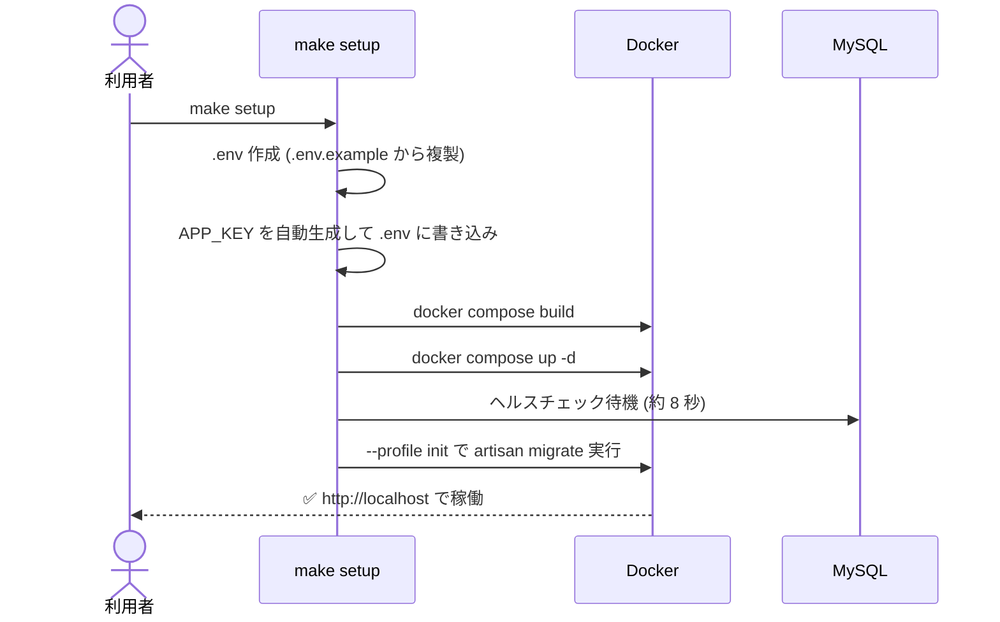
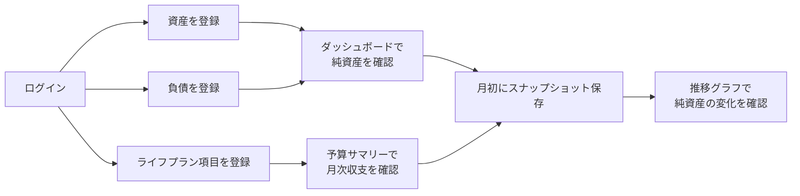
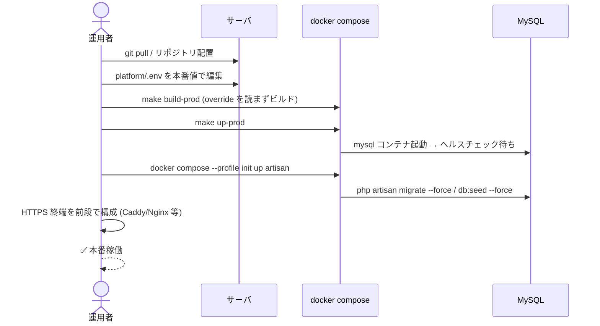
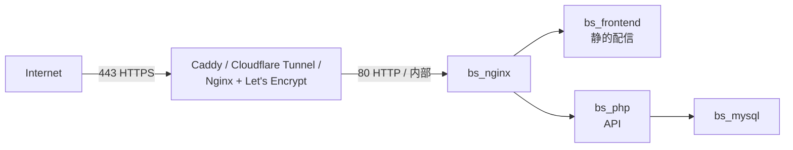
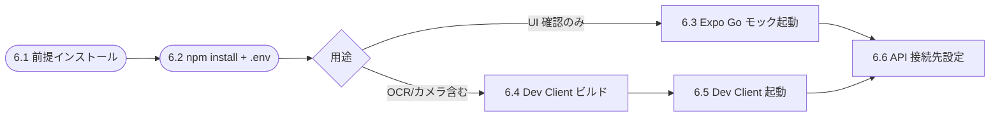

# 運用手順書 — 家計バランスシート

> 対象読者: 本アプリを「自分用に立ち上げて使いたい」「デモを試したい」「本番として常用したい」利用者・運用者。
> 本書はリポジトリ（`app/backend`, `app/frontend`, `platform/`）の構成を前提に、3つの利用シナリオを順に説明する。


---

## 0. 環境構築（共通の初回セットアップ）

デモ・本利用・本番のいずれでも最初に必要となる手順。

### 0.1 前提条件

| 項目 | 要件 |
|---|---|
| OS | macOS / Linux / Windows 10+（WSL2 推奨、ネイティブも対応） |
| Docker Desktop | 4.x 以降 (Docker Compose v2 対応) |
| Node.js | 18+（`setup.mjs` を使う場合のみ必須） |
| 必要ポート | `80` / `3306` / `5173` / `8080` が空いていること |
| ディスク空き | 概ね 2GB 以上 |

> Docker Desktop が起動していない場合は先に起動する。

### 0.1.1 クロスプラットフォーム注意事項

| OS | 推奨セットアップ方法 | 備考 |
|---|---|---|
| macOS | `make setup` または `node platform/setup.mjs` | どちらでも可 |
| Linux | `make setup` または `node platform/setup.mjs` | どちらでも可 |
| Windows (WSL2) | `make setup`（WSL2 上の Ubuntu 等で実行） | Docker Desktop は WSL2 統合を有効化 |
| Windows (ネイティブ / PowerShell) | `node platform\setup.mjs` | `make` 不要。Node.js 18+ が必要 |

**改行コード:** リポジトリ直下の `.gitattributes` で `.sh` / `Dockerfile` / `.env` 等を **強制 LF** にしているため、Windows の `core.autocrlf=true` 環境で clone しても Docker ビルドは壊れない。既に CRLF で取得してしまった場合は次で修復:

```bash
git rm --cached -r .
git reset --hard HEAD
```

### 0.2 リポジトリ構成

```
docker-balance-sheet/
├── app/
│   ├── backend/    Laravel ソース（PSR-4 構成のまま Docker で配置）
│   └── frontend/   React + Vite ソース
└── platform/       Docker / Nginx / DB 設定の集約先
```

`platform/` 配下からすべての操作を行う。

### 0.3 環境変数の作成（`platform/.env`）

```bash
cd platform
cp .env.example .env
```

`APP_KEY` の生成（`make setup` / `node setup.mjs` を使う場合は自動生成されるためスキップ可）:

**macOS（BSD sed）**:
```bash
KEY=$(docker run --rm php:8.3-cli php -r "echo 'base64:'.base64_encode(random_bytes(32));")
sed -i '' "s|^APP_KEY=.*|APP_KEY=$KEY|" .env
```

**Linux / WSL2（GNU sed）**:
```bash
KEY=$(docker run --rm php:8.3-cli php -r "echo 'base64:'.base64_encode(random_bytes(32));")
sed -i "s|^APP_KEY=.*|APP_KEY=$KEY|" .env
```

**Windows PowerShell**:
```powershell
$KEY = "base64:" + [Convert]::ToBase64String((1..32 | ForEach-Object { Get-Random -Max 256 } | ForEach-Object { [byte]$_ }))
(Get-Content .env) -replace '^APP_KEY=.*', "APP_KEY=$KEY" | Set-Content .env
```

**OS非依存（Node.js）**:
```bash
node -e "const c=require('crypto');console.log('base64:'+c.randomBytes(32).toString('base64'))"
# 出力を .env の APP_KEY= に貼り付け
```

`.env` で必ず確認するキー:

| キー | 用途 | 既定値 |
|---|---|---|
| `APP_ENV` | `local` / `production` | `local` |
| `APP_KEY` | Laravel 暗号化鍵（**必須**） | 空欄 |
| `APP_URL` | 公開 URL | `http://localhost` |
| `APP_DEBUG` | デバッグ表示 | `true`（本番では `false`） |
| `DB_DATABASE` / `DB_USERNAME` / `DB_PASSWORD` | DB 接続情報 | `balance_sheet` / `bs_user` / `secret` |

### 0.4 ワンコマンドでの初回セットアップ

#### macOS / Linux / WSL2

```bash
cd platform
make setup
```

#### Windows ネイティブ（make 不要）

```powershell
cd platform
node setup.mjs
```

`make setup` および `node setup.mjs` で実行される内容（同等）:



完了後、コンテナの状態確認:

```bash
docker compose ps
```

期待値:

| NAME | 役割 | STATUS |
|---|---|---|
| `bs_nginx` | リバースプロキシ + 静的配信 | Up |
| `bs_php` | Laravel (PHP-FPM) | Up |
| `bs_frontend` | React 本番ビルド成果物 | Up |
| `bs_mysql` | MySQL 8 | Up (healthy) |
| `bs_vite` | Vite 開発サーバ（override 適用時のみ） | Up |
| `bs_phpmyadmin` | phpMyAdmin（override 適用時のみ） | Up |

---

## 1. デモデータでの動作確認手順

> 目的: アプリの全機能を一通り触って動作確認する。実データを入れる前のリハーサルにも使える。

### 1.1 デモ用シードユーザー

| 項目 | 値 |
|---|---|
| Email | `test@example.com` |
| Password | `password` |
| 名前 | テストユーザー |

`CashflowItemSeeder` 実行時に `firstOrCreate` で自動作成される（存在しなければ作成）。

### 1.2 デモデータ投入

ライフプラン項目（収入・住居費・光熱通信・サブスク等の約 60 項目テンプレート）を投入する。

```bash
cd platform
docker compose exec -T php php artisan db:seed --class=Database\\Seeders\\CashflowItemSeeder
```

特徴:

- 主要サブスク（Netflix / Amazon Prime / YouTube / Oura など）には**購入先**と**解約 URL** を自動付与。
- `name` で `firstOrCreate` するため**再実行しても重複しない**。
- 金額は円単位、年齢区間（`start_age` / `end_age`）入りで挿入される。

### 1.3 デモ確認フロー

```mermaid
flowchart TD
    Start([http://localhost を開く]) --> Login[test@example.com / password でログイン]
    Login --> Dash[ダッシュボード:<br/>純資産 / 月次収支カード / 円グラフ]
    Dash --> Asset[資産ページ:<br/>サンプル資産を1件追加]
    Asset --> Liab[負債ページ:<br/>サンプル負債を1件追加]
    Liab --> BS[バランスシートページ:<br/>計算結果を確認]
    BS --> Life[ライフプラン:<br/>シード済み60項目を確認]
    Life --> CSV[CSVダウンロードを各ページで試行]
    CSV --> Snap[スナップショット保存]
    Snap --> Done([デモ完了])
```

### 1.4 API レベルでの疎通確認

```bash
curl -s -X POST http://localhost/api/auth/login \
  -H "Content-Type: application/json" \
  -H "Accept: application/json" \
  -d '{"email":"test@example.com","password":"password"}'
```

レスポンスに `user` と `token` が返れば正常。

### 1.5 デモデータの初期化（やり直したいとき）

```bash
make migrate-fresh    # ⚠️ 全テーブル DROP → 再作成 + 全シーダー再実行
```

---

## 2. 実際の利用手順（自分のデータで運用）

> 目的: 自分用の家計簿として日常運用する。デモユーザーとは別アカウントを作成して使う。

### 2.1 自分用アカウントの作成

#### 方法 A: ブラウザから新規登録（推奨）

1. `http://localhost` にアクセス
2. 「新規登録」から自分の Email / パスワードを入力
3. ログイン後、ダッシュボードが空の状態で表示される

#### 方法 B: artisan tinker で作成

```bash
docker compose exec -T php php artisan tinker --execute='
\App\Models\User::firstOrCreate(
    ["email" => "you@example.com"],
    ["name" => "Your Name", "password" => bcrypt("your-password")]
);'
```

### 2.2 実データ入力の流れ



### 2.3 主な操作

| やりたいこと | 操作 |
|---|---|
| 資産を増やす（預金・株・不動産など） | 「資産」ページ → 「追加」モーダル |
| 負債を増やす（住宅ローン・カード等） | 「負債」ページ → 「追加」モーダル |
| 月次の固定費を登録 | 「ライフプラン」ページで `direction=expense / frequency=fixed` を追加 |
| 副業・賞与など変動収入 | `direction=income / frequency=variable` で追加 |
| 解約候補のサブスクを管理 | `vendor` と `url`（解約ページ）を入れておくと項目名がリンクになる |
| 月次集計を見る | ダッシュボードの「月間収入 / 月間支出 / 月間収支」3カード |
| 資産配分を見る | ダッシュボードの円グラフ（流動・固定・投資の構成比） |
| Excel で集計 | 各ページ右上の「CSV ダウンロード」（BOM 付き UTF-8） |

### 2.4 推奨される定例運用

| 頻度 | 操作 | 目的 |
|---|---|---|
| 都度 | 資産・負債の金額更新 | 残高反映 |
| 月初 | バランスシートページ → 「スナップショット保存」 | 純資産の履歴を残す |
| 月次 | 予算サマリーで赤字チェック | マイナス時は警告色で表示される |
| 四半期 | CSV ダウンロードしてバックアップ | DB 障害時の保険 |

### 2.5 主要 API（外部連携・自動化向け）

> Rate Limit: `/auth/*` は IP ベース 5 req/min、認証付きルートは Sanctum トークンの user 単位で 60 req/min。

#### 認証

| Method | Path | 用途 |
|---|---|---|
| POST | `/api/auth/register` | ユーザー登録 + token 発行 |
| POST | `/api/auth/login` | ログイン（token 発行） |
| POST | `/api/auth/logout` | ログアウト（token 削除） |
| GET  | `/api/auth/me` | 認証ユーザー情報 |
| POST | `/api/auth/password/forgot` | パスワードリセットリンク送信 |
| POST | `/api/auth/password/reset` | リセット実行（token + 新パスワード） |

#### CRUD リソース（4 種類）

| Method | Path | 用途 |
|---|---|---|
| GET / POST / PUT / DELETE | `/api/assets` | 資産 CRUD |
| GET / POST / PUT / DELETE | `/api/liabilities` | 負債 CRUD |
| GET / POST / PUT / DELETE | `/api/cashflow-items` | ライフプラン CRUD |
| GET / POST / PUT / DELETE | `/api/expenses` | 実績家計簿 CRUD（`?from=YYYY-MM-DD&to=&category=` でフィルタ可） |
| POST | `/api/{resource}/reorder` | `{ ids: [...] }` で並び順を一括更新（assets / liabilities / cashflow-items） |

#### 集計・レポート

| Method | Path | 用途 |
|---|---|---|
| GET | `/api/balance-sheet` | 現在の B/S（カテゴリ別アイテム + 小計 + 純資産） |
| GET | `/api/balance-sheet/summary` | Dashboard 用サマリー（asset_ratio 含む） |
| GET | `/api/balance-sheet/comparison` | 前月比（最新 2 スナップショットの差分 + %） |
| GET | `/api/balance-sheet/export` | **B/S レポートを PDF ダウンロード（A4 縦、日本語）** |
| GET | `/api/budget/summary` | ライフプラン項目から月次・年次の収支集計 |
| GET | `/api/budget/projection?from=23&to=99` | 年齢別キャッシュフロー推移 |
| GET | `/api/budget/auto` | **実績ベースの自動予算（3 ヶ月で月予算、6 ヶ月で年予算が解禁）** |

#### エクスポート / スナップショット

| Method | Path | 用途 |
|---|---|---|
| GET | `/api/assets/export` | 資産 CSV（UTF-8 BOM 付き） |
| GET | `/api/liabilities/export` | 負債 CSV |
| GET | `/api/cashflow-items/export` | ライフプラン CSV |
| GET | `/api/snapshots` | スナップショット一覧（推移グラフ用） |
| POST | `/api/snapshots` | スナップショット保存 |
| DELETE | `/api/snapshots/{id}` | スナップショット削除 |

`cashflow-items` の `monthly_amount` / `annual_amount` は片方のみ送信でもサーバ側で `× 12` / `÷ 12` 自動補完される。
`assets` / `liabilities` / `cashflow-items` は同ユーザー × 同カテゴリ内で `name` の重複が禁止されており、各リソース 200 件/ユーザーが上限。

#### 動作確認 curl

```bash
TOKEN="..."
# 自動予算
curl -H "Authorization: Bearer $TOKEN" http://localhost/api/budget/auto

# PDF エクスポート
curl -H "Authorization: Bearer $TOKEN" http://localhost/api/balance-sheet/export -o balance-sheet.pdf

# パスワードリセット (開発時は MAIL_MAILER=log で laravel.log にメール本文が出る)
curl -X POST -H "Content-Type: application/json" \
     -d '{"email":"test@example.com"}' \
     http://localhost/api/auth/password/forgot
```

### 2.6 日常コマンド早見表

```bash
make up              # 朝・PC再起動後の起動
make down            # 終了
make logs            # 全ログ追跡
make logs-php        # PHP のみ
make logs-nginx      # Nginx のみ
make shell           # PHP コンテナに入る
make artisan CMD="migrate:status"   # 任意 artisan コマンド
make seed            # シーダー再実行
```

---

## 3. 本番稼働手順

> 目的: 自宅サーバ・VPS・クラウド VM 等で常用稼働させる。`docker-compose.override.yml`（HMR・phpMyAdmin）は使わず、本番用の compose ファイルのみを使う。

### 3.1 本番モードの定義

| 観点 | 開発モード | **本番モード** |
|---|---|---|
| compose ファイル | `docker-compose.yml` + `override.yml` | `docker-compose.yml` のみ |
| Vite | `bs_vite` HMR サーバ稼働 | フロントは静的ビルドのみ（`bs_frontend`） |
| phpMyAdmin | `bs_phpmyadmin` 公開 | 起動しない |
| `APP_ENV` | `local` | `production` |
| `APP_DEBUG` | `true` | `false` |

### 3.2 本番用 `.env` の準備

```bash
cd platform
cp .env.example .env
```

本番では以下を必ず編集する:

```ini
APP_ENV=production
APP_DEBUG=false
APP_URL=https://your-domain.example.com
APP_KEY=<必ず再生成して上書き>

DB_DATABASE=balance_sheet
DB_USERNAME=<本番用ユーザー名>
DB_PASSWORD=<十分に強いパスワード>
DB_ROOT_PASSWORD=<root も強いパスワード>

SANCTUM_STATEFUL_DOMAINS=your-domain.example.com
SESSION_DOMAIN=your-domain.example.com
LOG_LEVEL=warning
```

`APP_KEY` を再生成（OS 別の手順は 0.3 を参照）。最も移植性の高い方法は **Node.js + 移植版 awk**:

```bash
# Node 18+ が利用可能ならこれが最速かつ OS 非依存
node platform/setup.mjs   # APP_KEY 再生成 + ビルド + 起動 + マイグレーションを一括
```

個別に APP_KEY だけ差し替えたい場合（macOS / Linux / WSL2 共通）:

```bash
KEY=$(docker run --rm php:8.3-cli php -r "echo 'base64:'.base64_encode(random_bytes(32));")
awk -v k="$KEY" '/^APP_KEY=/{print "APP_KEY="k; f=1; next} {print} END{if(!f) print "APP_KEY="k}' .env > .env.tmp && mv .env.tmp .env
```

### 3.3 本番起動シーケンス



#### コマンド

```bash
cd platform

# ビルド（override を含めない）
make build-prod
# ↑ 内部で: docker compose -f docker-compose.yml build

# 起動（override を含めない）
make up-prod
# ↑ 内部で: docker compose -f docker-compose.yml up -d

# 初期マイグレーション + シーダー（init プロファイル）
docker compose -f docker-compose.yml --profile init up artisan
```

> `make up` と `docker compose up -d` は**自動で `override.yml` を読む**ため本番では使用禁止。必ず `make up-prod`（または `-f docker-compose.yml` を明示）を使う。

### 3.4 HTTPS 終端 / 公開構成

本サービスは `bs_nginx` が **80 番ポート (HTTP)** のみを公開する。本番ではその前段に HTTPS リバースプロキシを置く構成が推奨。



`SANCTUM_STATEFUL_DOMAINS` と `SESSION_DOMAIN` を本番ドメインに合わせること。Cookie ベースの SPA 認証が壊れないようにするための設定。

### 3.5 本番運用の必須チェック

| チェック | コマンド / 確認方法 |
|---|---|
| `APP_DEBUG=false` | `grep ^APP_DEBUG platform/.env` |
| `APP_KEY` がローカルと別 | `.env` の `APP_KEY` を再生成済みか |
| MySQL のポート公開を絞る | 公開ネットワークでは `docker-compose.yml` の `ports: "3306:3306"` を**削除**または `127.0.0.1:3306:3306` に変更 |
| phpMyAdmin が動いていない | `docker compose ps` に `bs_phpmyadmin` が**ない** |
| Vite が動いていない | `docker compose ps` に `bs_vite` が**ない** |
| HTTPS 終端 | 前段プロキシで `https://` 化されている |
| バックアップ | 後述 3.7 を cron で定期化 |

### 3.6 アップデート（再デプロイ）手順

```bash
cd platform

# 1. 最新ソースを取得
git pull

# 2. ダウンタイム最小化のため再ビルド → 入れ替え
make build-prod
make up-prod        # 既存コンテナを差分で再作成

# 3. マイグレーション差分があれば実行
docker compose -f docker-compose.yml exec php php artisan migrate --force

# 4. キャッシュ刷新
docker compose -f docker-compose.yml exec php php artisan optimize:clear
```

### 3.7 バックアップ / リストア

> 専用スクリプトを `platform/scripts/` に同梱。手書き mysqldump よりこちらを推奨。

#### バックアップ（毎日 cron 推奨）

```bash
# 単発実行（既定: ./backups/、世代管理 7 世代）
./platform/scripts/backup-mysql.sh

# 任意の出力先 + cron 例
crontab -e
# 毎日 03:00 に取得 + 7 世代を超えた古いものは自動削除
0 3 * * * /opt/balance-sheet/platform/scripts/backup-mysql.sh /var/backups/balance-sheet >> /var/log/bs-backup.log 2>&1
```

スクリプトの中身は `docker compose exec -T mysql mysqldump --single-transaction --routines --triggers --no-tablespaces` + gzip 圧縮。`platform/.env` から `DB_DATABASE` `DB_USERNAME` `DB_PASSWORD` を自動読込。

#### リストア

```bash
./platform/scripts/restore-mysql.sh /var/backups/balance-sheet/balance_sheet-20260510-030000.sql.gz
# → "yes" 入力確認の後に実行（誤操作防止）
```

#### SSL 証明書（Let's Encrypt）

```bash
sudo ./platform/scripts/install-ssl.sh balance.example.com admin@example.com
# → certbot で証明書取得後、default.conf に追記すべき HTTPS ブロックと
#   docker-compose.yml の volumes 設定を stdout 出力
```

自動更新は systemd timer + post-hook で `docker compose restart nginx`。

#### ボリュームの保全対象

| ボリューム | 内容 | バックアップ要否 |
|---|---|---|
| `mysql_data` | DB 本体 | **必須** (上記スクリプトで論理バックアップ) |
| `laravel_app` | ビルド済み Laravel スケルトン | 不要（イメージから再生成可能） |
| `frontend_dist` | ビルド済み静的アセット | 不要（同上） |
| `/etc/letsencrypt` | SSL 証明書（本番のみ） | バックアップ推奨（紛失時は再取得可だが手間） |

---

## 4. 運用コマンド一覧（早見表）

| 用途 | コマンド | モード |
|---|---|---|
| 起動 | `make up` | 開発 |
| 起動（本番） | `make up-prod` | 本番 |
| 停止 | `make down` | 共通 |
| 全ログ追跡 | `make logs` | 共通 |
| PHP ログ | `make logs-php` | 共通 |
| Nginx ログ | `make logs-nginx` | 共通 |
| PHP コンテナ Shell | `make shell` | 共通 |
| MySQL クライアント | `make shell-mysql` | 共通 |
| マイグレーション | `make migrate` | 共通 |
| マイグレーション再実行（**全消し**） | `make migrate-fresh` | 開発のみ |
| シーダー | `make seed` | 共通 |
| 任意 artisan | `make artisan CMD="..."` | 共通 |
| キャッシュクリア | `make cache-clear` | 共通 |
| 本番ビルド | `make build-prod` | 本番 |
| 初回セットアップ | `make setup` | 開発 |

---

## 5. トラブルシューティング

| 症状 | 原因の切り分け | 対処 |
|---|---|---|
| `docker compose ps` で `mysql` が `unhealthy` | 起動待機不足 / 旧データ破損 | `docker compose logs mysql` → 必要なら `docker compose down -v` で再作成（**全データ削除注意**） |
| 画面が真っ白 | フロントビルド失敗 / nginx と frontend のボリューム共有不良 | `docker compose logs frontend` → `make build-prod` で再ビルド |
| ログイン後すぐ 401 | `SANCTUM_STATEFUL_DOMAINS` / `SESSION_DOMAIN` が現ドメインと不一致 | `.env` を修正 → `make cache-clear` |
| HMR が効かない | `override.yml` が無効化されている | `docker compose ps` で `bs_vite` の有無を確認 |
| `php artisan` が `APP_KEY missing` で落ちる | `.env` 未配置 / `APP_KEY` 未設定 | 0.3 を再実施 |
| 502 Bad Gateway | PHP-FPM 落ち | `docker compose ps php` → `docker compose restart php` |
| 5173 / 8080 にアクセスできない | 本番モードでは起動しないのが正常 | 開発モードで起動するなら `make up`（override を読む） |
| マイグレーションが空回り | DB 名/ユーザー名の不一致 | `.env` の `DB_*` と `docker compose exec mysql ...` で一致確認 |
| ログインで 429 Too Many Requests | Rate Limit (5 req/min/IP) に到達 | 1 分待つ。本番ではプロキシの `X-Forwarded-For` を信頼するよう `TrustProxies` 設定を確認 |
| パスワードリセットメールが届かない | `MAIL_MAILER=log` のまま | 開発時は `storage/logs/laravel.log` を確認。本番は `MAIL_MAILER=smtp` + `MAIL_HOST` 等を設定 |
| PDF 出力で `class Pdf not found` | `barryvdh/laravel-dompdf` 未インストール | `composer require barryvdh/laravel-dompdf:^3.0` |
| PDF の日本語が文字化け | dompdf のフォント設定 | Blade の `font-family: 'ipag'` を確認。dompdf は ipag を標準同梱 |
| `php artisan test` で SQLSTATE エラー | テスト用 DB が未準備 | `.env.testing` または `phpunit.xml` の `DB_DATABASE` を確認、`migrate --env=testing` |

---

## 6. モバイルアプリ（iOS / Android）の起動手順

> 対象: `app/mobile/` の Expo Managed + Dev Client プロジェクト。
> 詳細な実装計画と技術選定は [work.md](./work.md) を参照。
> Expo Go（モック起動）と Dev Client（ネイティブ機能込み）の 2 段構えで運用する。



### 6.1 前提条件

| 項目 | 要件 | 備考 |
|---|---|---|
| Node.js | 20+（LTS） | Web 版より新しい必要あり |
| npm | 10+ | pnpm でも可 |
| Expo Go アプリ | iOS / Android のストアから | モック起動のみ必要 |
| Xcode | 最新 | iOS Simulator を使う場合（macOS 必須） |
| Android Studio + AVD | API 34 以降 | Android Emulator を使う場合 |
| EAS CLI | `npm install -g eas-cli` | Dev Client ビルドに必要 |
| Apple Developer Program | 年 $99 | iOS 実機配布する場合 |
| Expo アカウント | 無料 | EAS Build を使う場合 |

> **重要**: OCR / カメラを実機検証する場合は **Dev Client が必須**。Expo Go では `@react-native-ml-kit/text-recognition` などのネイティブモジュールが動かない。

### 6.2 セットアップ（初回のみ）

```bash
cd app/mobile
npm install                     # 1232 packages、約 40 秒
cp .env.example .env
# .env を編集して API 接続先を実環境に合わせる（→ 6.6）
```

> **deprecation 警告 / 脆弱性 警告について**: `npm install` 時に大量の警告が出るが、Expo SDK 内部の transitive 依存に起因するものでアプリ動作に影響なし。`npm audit fix --force` は SDK 依存ツリーを破壊するので **絶対に実行しない**。Expo SDK のバージョンアップ時に自然解消されるのを待つのが正解。

### 6.3 モック起動（Expo Go）— UI 確認用

ネイティブ機能（カメラ・OCR）を **使わず** に UI とロジックだけ確認するモード。
バックエンド（Laravel API）はあらかじめ `make up` で起動しておくこと。

```bash
cd app/mobile
npm run start:go                # = expo start
```

QR コードがターミナルに表示される。実機の **Expo Go アプリ** で QR を読み取ると即座にアプリが起動する。

| プラットフォーム | 起動方法 |
|---|---|
| iOS 実機 | カメラアプリで QR を読む → Expo Go で開く |
| Android 実機 | Expo Go アプリ内の QR Scanner |
| iOS Simulator (macOS) | 起動後ターミナルで `i` キー押下 |
| Android Emulator | 起動後ターミナルで `a` キー押下 |
| Web プレビュー（参考） | 起動後ターミナルで `w` キー押下 ※ネイティブ機能は不可 |

**Expo Go で動かないもの:**
- レシート OCR（`ReceiptScannerScreen`）→ ボタンタップ時にエラー
- 一部のカメラ機能

→ ここで詰まる場合は 6.4 の Dev Client へ。

### 6.4 Dev Client ビルド（OCR / カメラを使う場合の初回のみ）

`expo-dev-client` を含む独自ビルドを EAS（Expo のクラウドビルドサービス）で生成し、実機 / シミュレータにインストールする。

```bash
cd app/mobile

# EAS CLI セットアップ（初回のみ）
npm install -g eas-cli
eas login                       # Expo アカウントでログイン
eas build:configure             # 既存の eas.json を検出して上書き確認
```

#### iOS Dev Client ビルド

```bash
eas build --profile development --platform ios
# → クラウドで .ipa 生成（10〜20 分）
# → ビルド完了 URL が表示される
# → 実機: TestFlight 経由 または 内部配布リンクから直接インストール
# → Simulator: ビルド成果物が .tar.gz の場合は展開して `xcrun simctl install booted *.app`
```

iOS 実機で動かす場合は Apple Developer Program 加入と App ID / Bundle ID 登録が必要。EAS が証明書とプロビジョニングプロファイルを自動管理する。

#### Android Dev Client ビルド

```bash
eas build --profile development --platform android
# → クラウドで .apk 生成（10〜20 分）
# → 実機 / Emulator: ダウンロードした .apk をインストール
adb install path/to/dev-client.apk
```

Android は Google Play Developer 登録（25 USD 一回限り）なしで .apk を直接インストール可能。

### 6.5 Dev Client での開発実行

Dev Client を実機 / シミュレータにインストール済みの状態で:

```bash
cd app/mobile

# Metro bundler を Dev Client モードで起動
npm run start                   # = expo start --dev-client

# プラットフォーム指定で同時起動
npm run ios                     # iOS Simulator + Dev Client
npm run android                 # Android Emulator + Dev Client
```

QR を Dev Client アプリで読み取る、または同 LAN なら自動で接続される。
**JS のみの変更はホットリロードで即反映**。ネイティブ依存（`expo-camera` / `@react-native-ml-kit/*` 等）を追加・更新した場合のみ Dev Client の再ビルドが必要。

### 6.6 API 接続先の設定（重要）

実機 / Emulator から Laravel API（Docker 上）に到達するための URL は環境ごとに異なる:

| 環境 | `EXPO_PUBLIC_API_URL` の値 | 備考 |
|---|---|---|
| iOS Simulator (macOS) | `http://localhost/api` | 同マシン上のポートに直接アクセス可能 |
| Android Emulator | `http://10.0.2.2/api` | エミュレータからホスト OS への特殊ルート |
| 実機（同 LAN） | `http://<開発機の LAN IP>/api`（例: `http://192.168.1.10/api`） | Mac の場合 `ipconfig getifaddr en0` で IP 確認 |
| 本番 / ステージング | `https://your-domain.example.com/api` | iOS は ATS により HTTPS 必須 |

設定方法は 2 通り:

```bash
# A. .env ファイル（推奨・ローカル開発）
cd app/mobile
echo 'EXPO_PUBLIC_API_URL=http://192.168.1.10/api' > .env
# 起動時に自動で読まれる

# B. EAS ビルドプロファイルに埋め込む（preview / production 用）
# → eas.json の "env": { "EXPO_PUBLIC_API_URL": "..." } を編集してから eas build
```

> **CORS 設定**: モバイルからのリクエストは Origin が固定でないため、`platform/` 側 Laravel の `config/cors.php` で `allowed_origins => ['*']` または対象ドメインを許可しておく。Sanctum の `SANCTUM_STATEFUL_DOMAINS` はモバイルからは無関係（Bearer Token 認証のみ使用）。

### 6.7 動作確認チェックリスト

| 項目 | 確認方法 |
|---|---|
| 起動 | スプラッシュ → 認証画面 が表示される |
| 認証 | デモアカウント（[1.1](#11-デモ用シードユーザー)）でログイン成功 |
| Dashboard | 純資産 hero / 総資産・総負債カードが表示される |
| 資産追加 | ＋追加ボタン → モーダル → 保存 → 一覧に反映 |
| 負債追加 | 同上 |
| ライフプラン | 月額 / 年額トグル + 収入/支出フィルタが効く |
| B/S レポート | セクション別に表示・CSV 共有が iOS Files / Android ダウンロードに保存される |
| 家計簿（実績） | カテゴリ + 金額 + 日付で記録 → 自動予算カードがリアルタイム更新 |
| OCR（Dev Client のみ） | 📷レシート撮影 → カメラ起動 → 撮影 → ExpenseForm に金額・日付・店舗名が初期値として入る |
| プル to リフレッシュ | Dashboard / LifePlan / Expenses で下に引いて更新 |

### 6.8 トラブルシューティング（モバイル）

| 症状 | 原因 | 対処 |
|---|---|---|
| `npm install` で ERESOLVE エラー | `victory-native` の peer 依存衝突 | `package.json` の `overrides` で `@shopify/react-native-skia: 1.2.3` を強制（既設定済み） |
| Expo Go で「Network response timed out」 | API URL が `localhost` のまま | 実機の場合 `.env` の `EXPO_PUBLIC_API_URL` を LAN IP に変更 |
| Android Emulator で API に繋がらない | `localhost` を使っている | `http://10.0.2.2/api` に変更 |
| iOS 実機で「The resource could not be loaded because the App Transport Security policy requires the use of a secure connection」 | iOS の ATS が HTTP を遮断 | API を HTTPS で配信する（[3.4](#34-https-終端--公開構成) 参照） |
| OCR ボタンが反応しない / クラッシュ | Expo Go で起動している | Dev Client をビルドして使う（6.4） |
| カメラ画面が真っ黒 | カメラ権限が未許可 | iOS: 設定 → アプリ名 → カメラ ON / Android: 設定 → アプリ → 権限 → カメラ ON |
| Dev Client が「No development build installed」 | ビルドが端末にない / Bundle ID 不一致 | `eas build --profile development --platform <ios|android>` で再ビルドして再インストール |
| 「Unable to resolve module」 | 新規依存追加後にキャッシュ不整合 | `npx expo start --clear` で Metro キャッシュ破棄 |
| 起動後すぐログアウト状態に戻る | `AsyncStorage` の token が消えている / 期限切れ | 再ログインで OK。常に再現するなら `authApi.me()` のレスポンスを確認 |
| TS エラー `Property 'refreshing' does not exist on ScrollView` | `FlatList` のプロパティを誤用 | `refreshControl={<RefreshControl ... />}` に書き換え |

---

## 参考

- 設計資料: [design.md](./design.md)
- タスクリスト: [task.md](./task.md)
- 実装履歴: [history.md](./history.md)
- モバイル実装計画: [work.md](./work.md)
- モバイル README: [../app/mobile/README.md](../app/mobile/README.md)
- platform 配下の README: [../platform/README.md](../platform/README.md)
